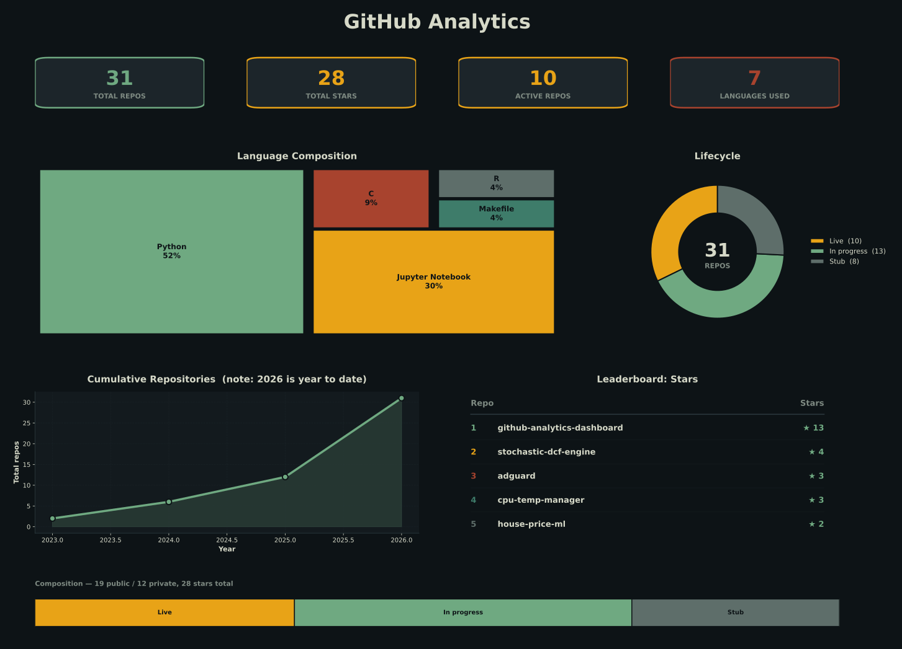
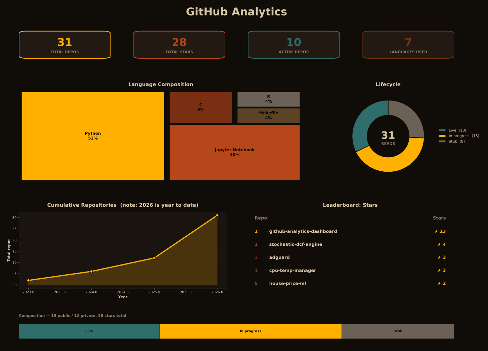
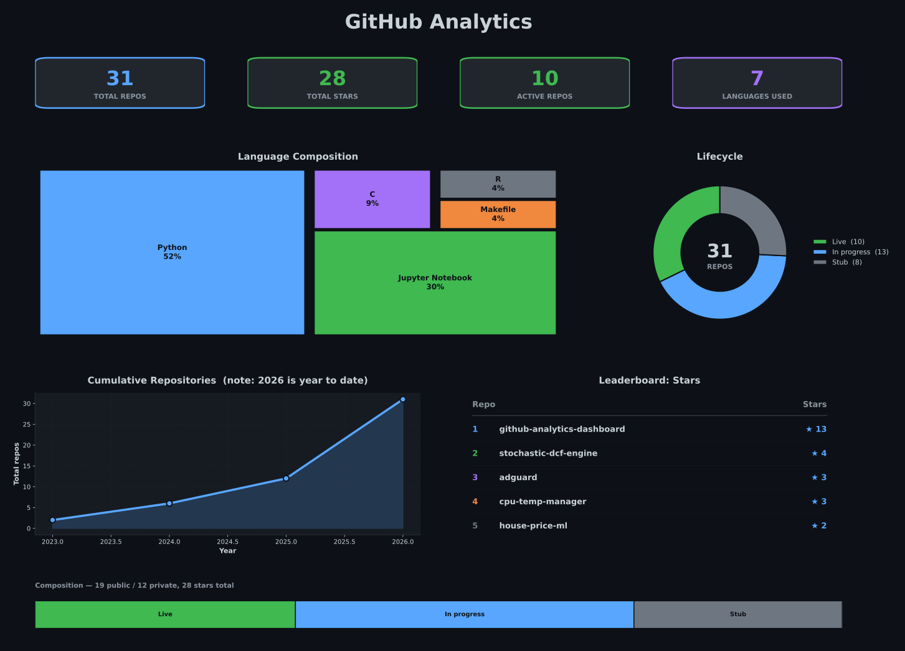

# GitHub Analytics Dashboard

Automated data pipeline that fetches repository data from the GitHub API and generates data visualizations.

## Dashboard Preview



## Features

- Automated ETL pipeline for GitHub repository data
- Theme-able dark dashboard (see [Themes](#themes) below)
- Fork-excluded portfolio view — only your own work is counted
- Lifecycle classification (Live / In progress / Shipped / Stub / Archived)
- Language composition treemap
- Cumulative repository growth
- Star leaderboard and portfolio composition breakdown

## Project Structure

```
github-analytics-dashboard/
├── src/
│   ├── config.py       # Environment configuration
│   ├── palettes.py     # Theme color definitions
│   ├── extract.py      # GitHub API data extraction
│   ├── transform.py    # Data processing and enrichment
│   └── main.py         # Pipeline orchestration
├── assets/
│   └── dashboard.py    # Visualization generation
├── data/               # Generated outputs
├── notebooks/          # Data exploration
└── requirements.txt    # Python dependencies
```

## Installation

1. Clone the repository

```bash
git clone <repository-url>
cd github-analytics-dashboard
```

2. Create and activate virtual environment

```bash
python -m venv .venv
source .venv/bin/activate  # On Windows: .venv\Scripts\activate
```

3. Install dependencies

```bash
pip install -r requirements.txt
```

4. Configure environment variables

Create a `.env` file in the project root:

```env
GITHUB_TOKEN=your_personal_access_token
USERNAME=your_github_username
```

To generate a GitHub token:

- Go to GitHub Settings > Developer settings > Personal access tokens
- Create a token with `repo` scope for private repositories
- Copy the token to your `.env` file

## Usage

```bash
cd src
python main.py
```

The pipeline will:

1. Fetch all repositories from your GitHub account
2. Process and enrich the data with calculated metrics
3. Generate visualizations and save outputs to `data/`

## Output Files

- `data/github_repos_clean.csv` - Processed repository data
- `data/github_dashboard.svg` - Analytics dashboard visualization

## Data Metrics

The pipeline calculates:

- Total repositories and active status (forks excluded — see below)
- Star and language counts
- Repository size and age
- Days since last push
- Lifecycle stage (see below)

### Forks are excluded

`transform.py` drops any repository where GitHub's API reports `fork: true`
before computing metrics. The dashboard is meant to report on your own work,
not repos you cloned from someone else. This means the total repo count (and
every percentage derived from it) reflects "your portfolio minus forks," not
your full GitHub account.

### Lifecycle classification

Each repo is assigned a `stage`, in this order:

| Stage                 | Rule                                  |
| --------------------- | ------------------------------------- |
| **Archived**    | `archived` flag set on GitHub       |
| **Live**        | pushed to within the last 90 days     |
| **In progress** | last push between 90 and 365 days ago |
| **Stub**        | last push over a year ago             |

This is purely activity-based (recency of the last push) rather than a
quality/maturity judgment — a repo you consider "done" still shows as Stub
once it's been quiet for a year, and that's intentional: the dashboard is
reporting on activity, not grading your repos. Adjust the day thresholds in
`transform.py`'s `lifecycle()` if your own definition of "stale" differs.
`description`, `topics`, and `has_license` are still extracted per repo in
`transform.py` if you want to build your own quality signal on top of them.

### Language composition filter (optional)

The language treemap excludes `HTML`, `CSS`, and `JavaScript` by default —
these tend to be a side effect of a repo (a docs page, a build config) rather
than its primary language, and can crowd out what the repo is actually
written in. To include them again, open `assets/dashboard.py` and comment out
(or clear) `FILTERED_LANGS`:

```python
# FILTERED_LANGS = {"HTML", "CSS", "JavaScript"}
FILTERED_LANGS = set()
```

## Themes

Set `DASHBOARD_THEME` to switch the dashboard's color palette. Three themes
ship today, more are planned, and a theme builder (pick colors, preview live)
is on the roadmap.

```bash
DASHBOARD_THEME=lab python src/main.py
```

| `divergence` (default)                                  | `lab`                                     | `github`                                        |
| --------------------------------------------------------- | ------------------------------------------- | ------------------------------------------------- |
|  |  |  |
| Amber / auburn, warm and high-contrast                    | Petrol base with green/amber/auburn accents | GitHub's native dark palette                      |

To add your own theme, add a block to the `THEMES` dict in `src/palettes.py`
(copy an existing one and change the hex values) — it becomes selectable via
`DASHBOARD_THEME=<your-key>` immediately, no other code changes needed.

## License

MIT License

---

## Auto-Update with GitHub Actions

This repository includes a GitHub Action that automatically updates the dashboard daily at midnight UTC.

**Manual Trigger:** Go to Actions tab → "Update GitHub Analytics Dashboard" → Run workflow

**Schedule:** Daily at 00:00 UTC (configurable in `.github/workflows/update-dashboard.yml`)

**Theme:** Set a repository variable named `DASHBOARD_THEME` (Settings → Secrets and variables → Actions → Variables) to `divergence`, `lab`, or `github` to control the theme without a commit. Defaults to `divergence` if unset.

## Using in Your GitHub Profile

To display this dashboard in your GitHub profile README:

1. Make sure this repository is public
2. Enable GitHub Actions in repository settings
3. Add to your profile README (replace `YOUR_USERNAME` and `REPO_NAME`):

```markdown

```

The dashboard will automatically update daily via GitHub Actions.
